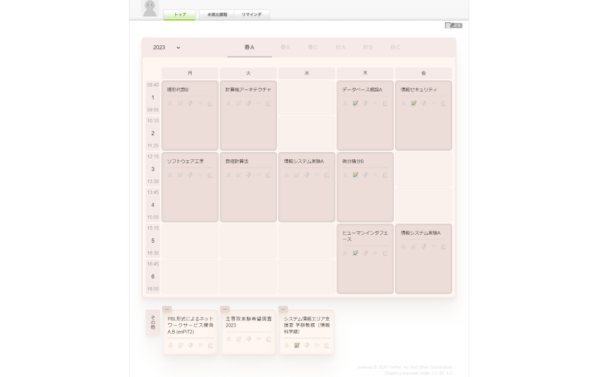

 

    
    <h1 align="center" style="border-bottom:none;color:red;">M-TimeTable</h1>

**筑波大学のmanabaの各コースへのリンクを時間割形式に配置**

 

[ 拡張機能を追加する（Chrome）](https://chrome.google.com/webstore/detail/m-timetable/jmfoeljnikfibijlkhmjgpjkdendagab)

 

## 概要

+ コースニュースを年度・モジュールごとに月～金・１～６限の時間割形式で表示します。
+ 土日開講、長期休暇期間中開講、特定の時間が決められていない......など、時間割に配置できない一部コースニュースは時間割下部に列挙して表示します。
+ 表示されたコースニュースをクリックすることでそのコースニュースのページに飛ぶことができます。
+ 筑波大学のmanaba上においてのみ動作します。

## 免責事項

本ソフトウェアは筑波大学およびmanabaの開発元である朝日ネット非公式のソフトウェアであり、筑波大学および朝日ネットとは無関係です。開発者は、本ソフトウェアを利用したこと、ないし本ソフトウェアの内容変更、中断、終了によって生じたいかなる損害について一切責任を負いません。

## ライセンス

M-TimeTable © 2023 [slimalized](https://github.com/slimalized)：Licensed under [MIT License](LICENSE).

twemoji © 2020 Twitter, Inc and other contributors：Graphics licensed under [CC-BY 4.0](https://creativecommons.org/licenses/by/4.0/).